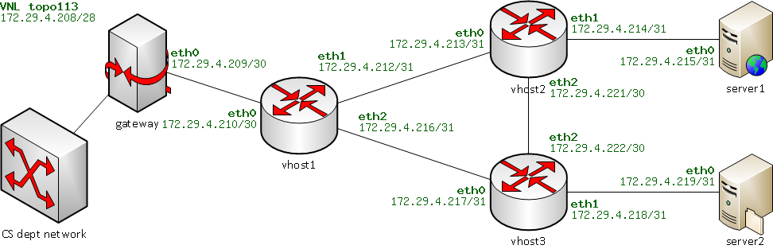

# PWOSPF Router Implementation

## 📋 Table of Contents
* [Overview](#-overview)
* [Project Objectives](#-project-objectives)
* [Features](#-features)
* [Technical Architecture](#-technical-architecture)
* [Getting Started](#getting-started) *(To be completed)*
* [Implementation Details](#implementation-details) *(To be completed)*
* [Testing and Validation](#testing-and-validation) *(To be completed)*
* [Contributing](#contributing) *(To be completed)*
* [License](#license) *(To be completed)*

## 🔍 Overview
This project implements a Pee-Wee OSPF (PWOSPF) router, a simplified version of the OSPF (Open Shortest Path First) routing protocol. PWOSPF is designed as a link-state routing protocol that enables routers to dynamically discover network topology, compute optimal paths, and adapt to network changes in real-time.

The implementation builds upon a basic router framework to create a fully functional dynamic routing system that can:
* Automatically discover neighboring routers
* Exchange network topology information
* Compute optimal paths to destinations
* Handle network failures and recoveries
* Maintain routing tables dynamically

## 🎯 Project Objectives

<strong>Primary Objectives</strong>

#### 1. Dynamic Route Discovery
Implement PWOSPF protocol to enable routers to:
* Build their own routing tables from link-state routing messages
* Detect link failures and recovery automatically
* Exchange routing information with neighboring routers

#### 2. Network Topology Management
* Maintain a complete view of the network topology
* Handle topology changes through link-state updates
* Support a multi-router environment with dynamic neighbor discovery

#### 3. Routing Protocol Implementation
* Implement HELLO protocol for neighbor discovery and maintenance
* Develop Link State Update (LSU) mechanism for topology information exchange
* Create efficient shortest path computation for routing decisions

<strong>Technical Requirements</strong>

#### 1. Protocol Specifications
* PWOSPF Version 2 compatibility
* Support for broadcast HELLO messages (every 10 seconds by default)
* Link State Updates (LSU) transmission (every 30 seconds by default)
* Proper handling of protocol headers and checksums

#### 2. Routing Features
* Support for static and dynamic routes
* Handling of directly connected subnets
* Default route management
* Subnet-based routing with proper mask handling

#### 3. Fault Tolerance
* Detection of neighbor timeouts (3× HELLO interval)
* Link failure and recovery handling
* Topology database maintenance and cleanup
* Route recomputation on network changes

## ⚡ Features

<strong>Core Routing Capabilities</strong>

* **Dynamic Routing Table Construction**
  * Automatic building of routing tables from link-state messages
  * Support for both static and dynamic routes
  * Intelligent handling of directly connected subnets
  * Default route management for internet connectivity

<strong>Protocol Implementation</strong>

* **HELLO Protocol**
  * Periodic broadcast of HELLO messages (10-second intervals)
  * Dynamic neighbor discovery and maintenance
  * Automatic detection of neighbor timeouts (30-second threshold)
  * Real-time neighbor state tracking

* **Link State Updates (LSU)**
  * Periodic LSU broadcasts (30-second intervals)
  * Efficient flooding mechanism with loop prevention
  * Sequence number tracking for update ordering
  * TTL-based flood control

<strong>Topology Management</strong>

* **Network Discovery**
  * Complete topology database maintenance
  * Automatic detection of network changes
  * Bidirectional link verification
  * Support for multi-router environments

* **Fault Tolerance**
  * Automatic link failure detection
  * Dynamic recovery from network changes
  * Topology database cleanup for stale entries
  * Immediate route recomputation on topology changes

<strong>Routing Algorithm & Protocol Specifications</strong>

* **Path Computation**
  * Implementation of shortest path algorithm
  * Subnet-based routing decisions
  * Proper handling of subnet masks
  * Next-hop computation for optimal forwarding

* **PWOSPF v2 Compliance**
  * Standard-compliant packet formats
  * Proper checksum calculation and verification
  * Area-based routing (single area support)
  * Router ID management

* **IP Packet Handling**
  * Protocol number 89 (OSPF standard)
  * Support for broadcast addresses
  * Proper IP encapsulation
  * Checksum verification and generation

* [Technical Architecture](#%EF%B8%8F-technical-architecture)

<strong>Network Topology</strong>

The project is developed and tested on a specific network topology consisting of three virtual PWOSPF routers (vhost1, vhost2, and vhost3) interconnected via subnets. This topology demonstrates the router's capability to handle dynamic route discovery, link failures, and network changes.

Key aspects of the topology:

* Each link represents a subnet, with two IP addresses (one for each end)
* All three routers (vhost1, vhost2, and vhost3) run the PWOSPF protocol
* The gateway provides connectivity to the internet (CS department network)
* Two servers act as end hosts for testing connectivity
* vhost1 connects to the gateway and serves as the internet access point
* Each router has multiple interfaces with specific IP/subnet configurations
* The topology allows testing of various scenarios including:
  * Dynamic route discovery
  * Link failure detection
  * Path recomputation
  * Network recovery

This topology is used for both development and testing, though IP assignments may differ during evaluation to ensure no hardcoding of addresses in the implementation.

<strong>System Components</strong>

### Core Components
* **PWOSPF Subsystem**
  * Controls protocol operations and neighbor discovery
  * Manages link-state database and routing updates
  * Handles HELLO and LSU packet processing

* **Interface Manager**
  * Manages multiple network interfaces
  * Processes incoming/outgoing PWOSPF packets
  * Maintains interface states and neighbor relationships

* **Route Calculator**
  * Implements shortest path computation
  * Updates routing table based on topology changes
  * Handles dynamic and static route management

